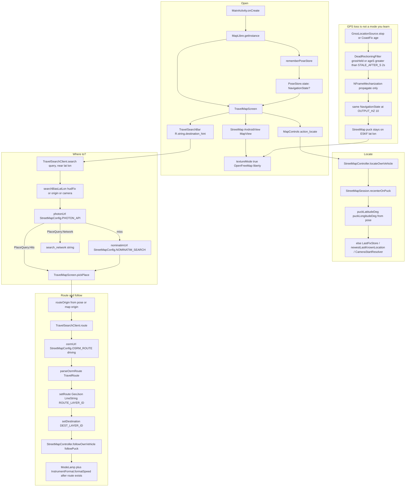
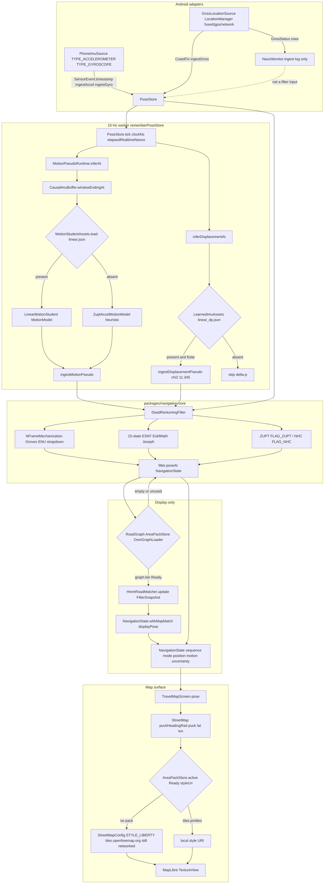

# DriftZero

[](https://github.com/NotDrake100/driftzero-sih26168/actions/workflows/ci.yml)

Phone-only vehicle navigation that keeps a blue puck moving when GPS drops. The map is the product. LastKnown builds it.

The consumer path is a phone, offline after an area pack is installed, no OBD-II, no vehicle speedometer, no LiDAR, no custom antenna, and no cloud inference. The filter emits `NavigationState` at 10 Hz. TimesFM is not in the APK.

Open the app, allow precise location, tap locate, type **Where to?**, pick a place, and follow the route. You do not flip a dead-reckoning switch. When GNSS is stale or held, `DeadReckoningFilter` keeps propagating the same `NavigationState` at 10 Hz.

Street tiles still come from the network (`StreetMapConfig.STYLE_LIBERTY` on OpenFreeMap) until a Ready `AreaPack` with `tiles.pmtiles` is sideloaded.

## Status

Honest as of 2026-09-03. Screening source of record: [results/io_vnbd_screening_v1/summary.md](results/io_vnbd_screening_v1/summary.md) (git `069e74b` plus the uncommitted `ml/` tree, seed 26168, IO-VNBD checkout `1189396`). The official median drift gate of 0.10 is not met. Do not cite a mean-only drift number. `filter_only` in that table is the Python coast. `kotlin_eskf` is the product `DeadReckoningFilter`: drift p50 6.6863 on 33 of 35 intervals, worse than persist 0.5168. LOW_CONFIDENCE 5326 of 11325 blackout states. S-S3b failed. Next step is diagnosis, not a new model.

**Works in this repository**

- Android travel map: MapLibre Native, Photon then Nominatim, public OSRM, locate, route follow, GPS-hold long-press. See [PRODUCT.md](PRODUCT.md).
- Live 10 Hz pose: `PoseStore` plus `DeadReckoningFilter` (ENU strapdown, 15-state ESKF, ZUPT/NHC). Modes `GNSS_FUSED`, `GNSS_DEGRADED`, `DEAD_RECKONING`, `REACQUIRING`, `LOW_CONFIDENCE`.
- Optional on-device speed weights in `models/motion_student_v1/linear.json` (corrected m/s labels, grouped session splits). Missing weights leave `ZuptAccelMotionModel`. Do not cite `train_report_invalid_kmh_labels.json`. `gru.json` is analysis-only. No Kotlin GRU runtime.
- Optional gated Δp from `models/learned_imu_v1/linear_dp.json`. The checked-in train report says Δp MAE is worse than freeze. Not a screening claim.
- Display-only HMM road match when an area pack has `graph.bin`. The matcher does not replace ESKF lat/lon.
- NavIC/IRNSS tallies from `GnssStatus`. Counts are log and chip only. They do not enter the filter.
- Python stdlib tests for contracts, blackout masking, metrics, IO-VNBD fixtures, and the TimesFM adapter boundary.
- JSON Schema for `SensorFrame` and `NavigationState` under `contracts/`.

**Planned or pending evidence**

- IO-VNBD raw CSVs are not in Git. Fetch with Git LFS into gitignored `data/raw/`. Commands: [scripts/fetch_datasets.md](scripts/fetch_datasets.md).
- Python screening bundle exists at [results/io_vnbd_screening_v1/summary.md](results/io_vnbd_screening_v1/summary.md). Official 10 percent median drift gate is not met. Product filter row `kotlin_eskf` is in that file, worse than persist. Next step is diagnosis of that filter, not a new model. Protocol: [docs/06_EVALUATION_PROTOCOL.md](docs/06_EVALUATION_PROTOCOL.md).
- TimesFM 3 desktop zero-shot and distillation: adapter and config exist. No keep/reject report in `results/`. 3.0 weights are non-commercial / non-production and cannot ship.
- Airplane-mode tiles and graph after a Ready area pack. Hosted OpenFreeMap is the stand-in until then.
- Judge-mode replay overlay and guided calibration UI. Specified, not published here.

## Start here

JDK 17 for JVM and Android. Python 3.10+ for `ml/`. Do not commit `data/raw` IO-VNBD CSVs.

```bash
PYTHONPATH=ml/src python -m unittest discover -s ml/tests -v
make validate
JAVA_HOME="$(/usr/libexec/java_home -v 17)" ./gradlew :navigation-core:test --no-daemon
JAVA_HOME="$(/usr/libexec/java_home -v 17)" ./gradlew :android-app:testDebugUnitTest :android-app:lintDebug :android-app:assembleDebug --no-daemon
```

`make validate` checks the four contract JSON files and reruns the Python tests. It does not invoke Gradle. `pytest.ini` uses the same `ml/src` path and `ml/tests` tree. Pytest and Ruff are optional (`./ml[dev]`). Unit tests use the standard library only.

Sideload notes: [demo/TESTER_SIDELOAD.md](demo/TESTER_SIDELOAD.md). Equation map: [docs/refs/INS_ESKF.md](docs/refs/INS_ESKF.md). How to contribute: [CONTRIBUTING.md](CONTRIBUTING.md).

## Repository map

| Path | What runs |
|---|---|
| `apps/android/app` | `MainActivity`, `TravelMapScreen`, `StreetMap`, `PoseStore`, Photon/OSRM |
| `packages/navigation-core` | `DeadReckoningFilter`, `HmmRoadMatcher`, `LinearMotionStudent` |
| `models/motion_student_v1/linear.json` | Optional on-device speed weights |
| `models/learned_imu_v1/linear_dp.json` | Optional gated Δp. Not a screening claim |
| `ml/` | Train/eval, IO-VNBD loaders, student export. [ml/README.md](ml/README.md) |
| `contracts/` | `SensorFrame` / `NavigationState` JSON Schema |
| `data/area-packs/` | Sideload target for PMTiles + `graph.bin` |
| `data/manifests/` | IO-VNBD screening manifest. Raw CSVs stay gitignored |
| `docs/adr/` | Filter, TimesFM teacher, offline maps, pose store, motion pseudo-measurement |
| `configs/` | Filter defaults, blackout protocol, TimesFM experiment gate |
| `tools/maps/` | Bbox pack manifest and OSM clip helpers |

## Evidence

Python screening v1 is at [results/io_vnbd_screening_v1/summary.md](results/io_vnbd_screening_v1/summary.md). 35 gated held-out intervals. The official median drift gate of 0.10 is not met. Per-system p50, p90, p95, and worst are in that file. Do not cite a mean-only drift number. `filter_only` is the Python coast. `kotlin_eskf` is the product filter: drift p50 6.6863 on 33 of 35 intervals, worse than persist 0.5168. LOW_CONFIDENCE 5326 of 11325 blackout states. S-S3b failed. Score-only plots: `plots/S-Vta2_mid.png`, `S-S1_mid.png`, `S-S3b_mid.png`. A full release bundle should still match [docs/06_EVALUATION_PROTOCOL.md](docs/06_EVALUATION_PROTOCOL.md) section 11. Latency and satellite figures are not in this bundle. Next step is diagnosis of the Kotlin filter, not a new model.

Desktop train reports live next to the JSON weights:

- `models/motion_student_v1/train_report.json` and `models/motion_student_v1.manifest.json` (corrected m/s labels)
- `models/motion_student_v1/train_report_invalid_kmh_labels.json` (old 3.6x-small labels; do not cite)
- `models/motion_student_v2/train_report.json` and `gru.json` (analysis-only)
- `models/learned_imu_v1/train_report.json` and `models/learned_imu_v1.manifest.json`

Linear Δp is worse than freeze. Keep the χ² gate. Bump-gated R raised bump-window PICP 68 and did not change speed MAE. That is the only novelty claim.

Regenerate (needs a real IO-VNBD tree under `data/raw/io_vnbd/`, or synthetic if LFS is missing):

```bash
PYTHONPATH=ml/src python -m driftzero_ml.student.train --seed 26168
PYTHONPATH=ml/src python -m driftzero_ml.learned_imu --out models/learned_imu_v1
PYTHONPATH=ml/src python -m driftzero_ml.eval_iovnbd_blackout --out results/io_vnbd_blackout_eval.md
```

IO-VNBD LFS is pending for a clean clone. The only CSV in Git is `ml/tests/fixtures/io_vnbd_s_vta9_head.csv` (header plus 3 rows, CC BY 4.0 excerpt).

## Trip on the phone

`MainActivity` starts MapLibre, builds `rememberPoseStore()`, and shows `TravelMapScreen`. The map is `StreetMap` on a TextureView (`StreetMapConfig.TEXTURE_MODE`) so Compose can composite it. Chrome is `TravelSearchBar` (`destination_hint` = Where to?), locate (`StreetMapController.locateOwnVehicle`), and a route sheet after a pick.

Photon is the geocoder. The query is biased to the live pose (`searchBiasLatLon` from `hudFix`, else map origin, else camera). Nominatim is fallback. A hit calls `TravelSearchClient.route` against public OSRM, draws a GeoJSON polyline, and `followPuck()`.



Long-press the GPS chip to hold GNSS (`PoseStore.setSimulateGpsOff`). Accel and gyro keep copying. The puck does not freeze. Long-press again to resume `ingestGnss`.

## Live engine

`rememberPoseStore` owns `PoseStore`, starts `PhoneImuSource` and `GnssLocationSource`, and calls `PoseStore.tick()` at `DeadReckoningFilter.OUTPUT_HZ` (10). Sensor callbacks only copy samples. Inference and filter updates run on that tick.

`DeadReckoningFilter` is strapdown INS in ENU (`NFrameMechanization`, Groves local-tangent) plus a 15-state ESKF (`EskfMath` Joseph update: δp, δv, δθ, ba, bg). Healthy GNSS younger than 2 s updates. Otherwise the filter propagates. ZUPT and NHC come from IMU statistics. `NavicMonitor` tallies IRNSS from `GnssStatus` and logs. Those counts do not enter the filter.

`MotionStudentAssets` loads `models/motion_student_v1/linear.json` when packed. Missing weights leave `ZuptAccelMotionModel`. Optional `LearnedImuAssets` / `linear_dp.json` injects a chi-squared gated Δp. `HmmRoadMatcher` (Newson-Krumm) writes `mapMatch` / display pose only. It does not replace ESKF lat/lon.



Modes on `NavigationState.mode` are `GNSS_FUSED`, `GNSS_DEGRADED`, `DEAD_RECKONING`, `REACQUIRING`, `LOW_CONFIDENCE`. The HUD chip reports them. The estimator does not wait for a user gesture to coast.

## Docs

Numbered files are 01 through 09. Existing numbers stay so citations do not break.

| Doc | Topic |
|---|---|
| [PRD.md](PRD.md) | Product requirements and scope |
| [PRODUCT.md](PRODUCT.md) | Five-step phone test |
| [AGENTS.md](AGENTS.md) | Engineering rules for this repo |
| [CONTRIBUTING.md](CONTRIBUTING.md) | How to run tests and change the tree |
| [SECURITY.md](SECURITY.md) | Local processing and how to report issues |
| [NOTICE.md](NOTICE.md) | Prototype notice and third-party attribution |
| [docs/01_REQUIREMENTS_TRACEABILITY.md](docs/01_REQUIREMENTS_TRACEABILITY.md) | Official requirement IDs |
| [docs/02_ARCHITECTURE.md](docs/02_ARCHITECTURE.md) | Runtime topology and package boundaries |
| [docs/03_TIMESFM3_STRATEGY.md](docs/03_TIMESFM3_STRATEGY.md) | TimesFM 3 desktop teacher, not the phone loop |
| [docs/04_DATASETS_AND_DATA_GOVERNANCE.md](docs/04_DATASETS_AND_DATA_GOVERNANCE.md) | Splits, blackouts, India collection |
| [docs/05_MAPS_AND_MAP_MATCHING.md](docs/05_MAPS_AND_MAP_MATCHING.md) | PMTiles plus HMM graph |
| [docs/06_EVALUATION_PROTOCOL.md](docs/06_EVALUATION_PROTOCOL.md) | Metrics and result bundle |
| [docs/07_RESEARCH_AND_ROADMAP.md](docs/07_RESEARCH_AND_ROADMAP.md) | Gap audit, evaluator defects, ranked plan to Sep 20 |
| [docs/08_PRODUCT_DESIGN.md](docs/08_PRODUCT_DESIGN.md) | Field-instrument UI spec |
| [docs/09_SECURITY_PRIVACY_SAFETY.md](docs/09_SECURITY_PRIVACY_SAFETY.md) | Privacy, integrity language, safety |
| [docs/SIH_THIRD_PARTY.md](docs/SIH_THIRD_PARTY.md) | Contest-facing third-party note |
| [docs/SOURCES.md](docs/SOURCES.md) | Citations |
| [docs/adr/001-hybrid-filter.md](docs/adr/001-hybrid-filter.md) | Hybrid student plus ESKF |
| [docs/adr/002-timesfm-teacher.md](docs/adr/002-timesfm-teacher.md) | TimesFM 3 as teacher |
| [docs/adr/003-offline-maps.md](docs/adr/003-offline-maps.md) | PMTiles and road graph |
| [docs/adr/004-cv-stub.md](docs/adr/004-cv-stub.md) | Pose store and GNSS-off coast (filename is historical) |
| [docs/adr/005-motion-pseudo-measurement.md](docs/adr/005-motion-pseudo-measurement.md) | Motion pseudo-measurement |
| [docs/refs/INS_ESKF.md](docs/refs/INS_ESKF.md) | Strapdown and ESKF equations |
| [docs/refs/DATASETS.md](docs/refs/DATASETS.md) | Dataset scorecard |
| [docs/refs/LEARNED_IMU.md](docs/refs/LEARNED_IMU.md) | RoNIN / TLIO / IONet heads |
| [docs/refs/MAP_MATCHING.md](docs/refs/MAP_MATCHING.md) | HMM formulas |
| [docs/refs/NAVIC.md](docs/refs/NAVIC.md) | IRNSS logging limits |
| [docs/refs/SIH26168_EVIDENCE.md](docs/refs/SIH26168_EVIDENCE.md) | Official problem text and independently fetched references |
| [demo/README.md](demo/README.md) | Demo package rules |

## Rules that stay true

Ground-truth GNSS may score a blackout. It must not enter features, the filter, the matcher, or recovery during that interval. No OBD, vehicle speedometer, cloud inference, or TimesFM on the phone path. Ambiguous road hypotheses stay uncertain. User-facing numbers include confidence and a reason. Do not invent metrics, traces, screenshots, satellite counts, or benchmark results.
