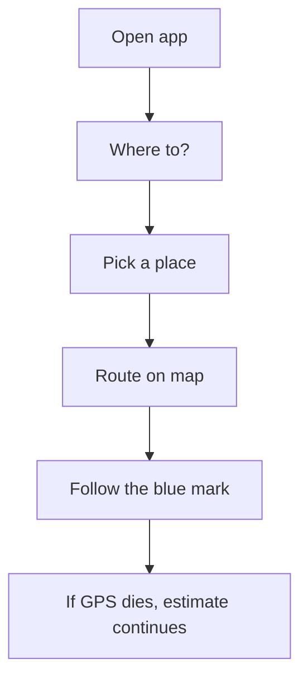
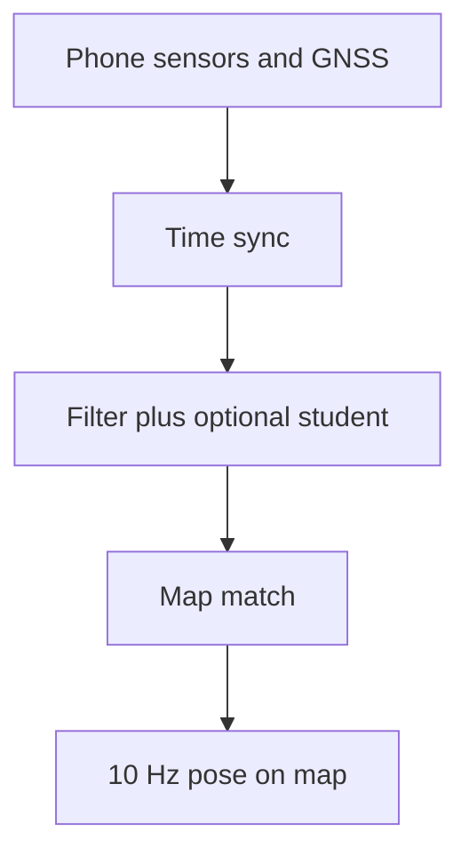

# DriftZero

Phone navigation that keeps a pose when GNSS fails.

DriftZero is an Android-first, software-only vehicle navigator. It keeps estimating a vehicle's position when GNSS is blocked, degraded, jammed, or inconsistent, using only the phone's accelerometer, gyroscope, magnetometer, GNSS, offline road data, and a compact on-device student when one is present.

Built by LastKnown.

This repository is a product spec plus a research harness: PRD, architecture, TimesFM 3 research strategy, datasets, offline map plan, evaluation protocol, Cursor rules, machine-readable contracts, experiment configuration, and tested metric utilities.

## Product promise

- Hold a pose through fused GNSS, degraded GNSS, and inertial dead reckoning.
- Standalone Android phone. No OBD-II, speedometer, cloud, or custom vehicle hardware.
- Target dead-reckoning drift below 10 percent of blackout distance, scored without label leakage.
- 10 Hz navigation output and an offline-first map.
- Navigation core can accept an external IMU. That is an engine interface, not a consumer requirement.
- Confidence and degradation states. No fake lane-level certainty.

## How a trip works

Product flow on the phone. The last step is product intent. The live estimator is not fully shipped.



## How the engine works

Runtime path from sensors to the map. Filter-only remains valid when the student is absent.



## The central technical decision

TimesFM 3 is not placed directly in the phone's 10 Hz navigation loop. The official model is roughly 0.3B parameters and its current weights are intended for research use. DriftZero uses it on desktop as a zero-shot multivariate forecasting baseline, uncertainty teacher, and hypothesis generator. If it improves held-out vehicle trajectories, its useful behavior is distilled into a small causal TCN or GRU student for on-device inference. The production loop remains deterministic, bounded, and functional even when the TimesFM adapter is absent.

## Start here

1. Read [PRD.md](PRD.md).
2. Review [architecture](docs/02_ARCHITECTURE.md) and [TimesFM 3 strategy](docs/03_TIMESFM3_STRATEGY.md).
3. Give Cursor [the master build prompt](tasks/CURSOR_MASTER_BUILD_PROMPT.md), then execute phase prompts in order.
4. Run the research utilities:

```bash
PYTHONPATH=ml/src python -m unittest discover -s ml/tests -v
```

## Repository map

| Path | Purpose |
|---|---|
| `PRD.md` | Product scope, users, requirements, acceptance criteria, and launch plan |
| `docs/` | Traceability, architecture, research decisions, data, maps, evaluation, safety, and sources |
| `.cursor/rules/` | Persistent rules for Android, navigation, ML, and evidence integrity |
| `tasks/` | Master and phased Cursor implementation prompts |
| `contracts/` | Canonical JSON Schemas for sensor input and navigation output |
| `configs/` | Versioned experiment and blackout definitions |
| `ml/` | Tested research utilities and optional TimesFM adapter |
| `apps/android/` | Android implementation specification and project scaffold target |
| `packages/navigation-core/` | Platform-neutral navigation engine contract |
| `demo/` | Reproducible demo runbook, video narration, and shot list |

## Non-negotiable validation rule

Ground-truth GNSS may be retained to score an artificial outage, but it must never enter the model, filter, map matcher, feature scaler, or outage detector during that interval. Every result must include the trajectory split, blackout definition, device/route metadata, model hash, map extract hash, and configuration file.

## Status

This initial repository is a specification plus research harness, not a claim that the complete Android product has already been implemented. The trip chart above is the intended driver flow. Routing, map matching, and the live estimator are still being built. Milestones are in [the roadmap](docs/08_ROADMAP_AND_BACKLOG.md).
