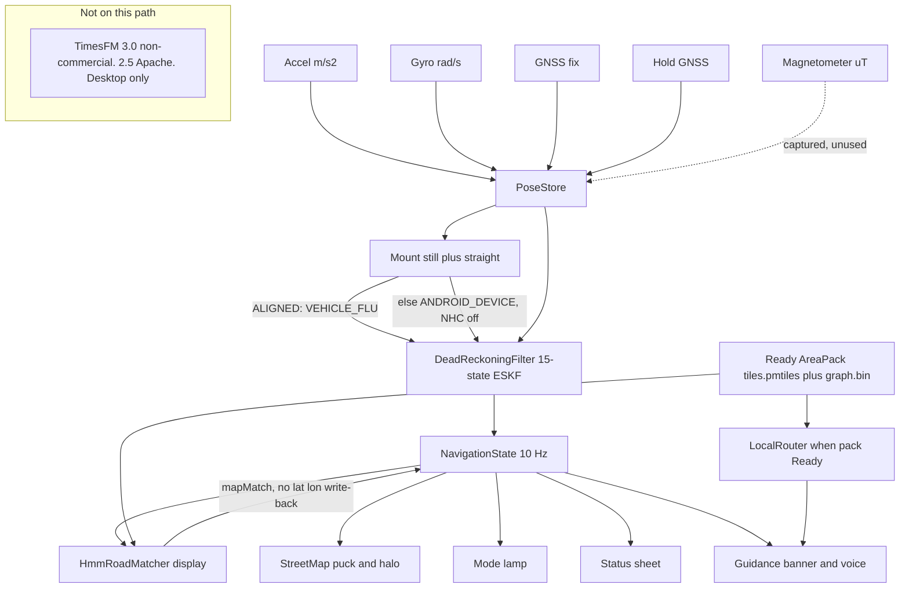
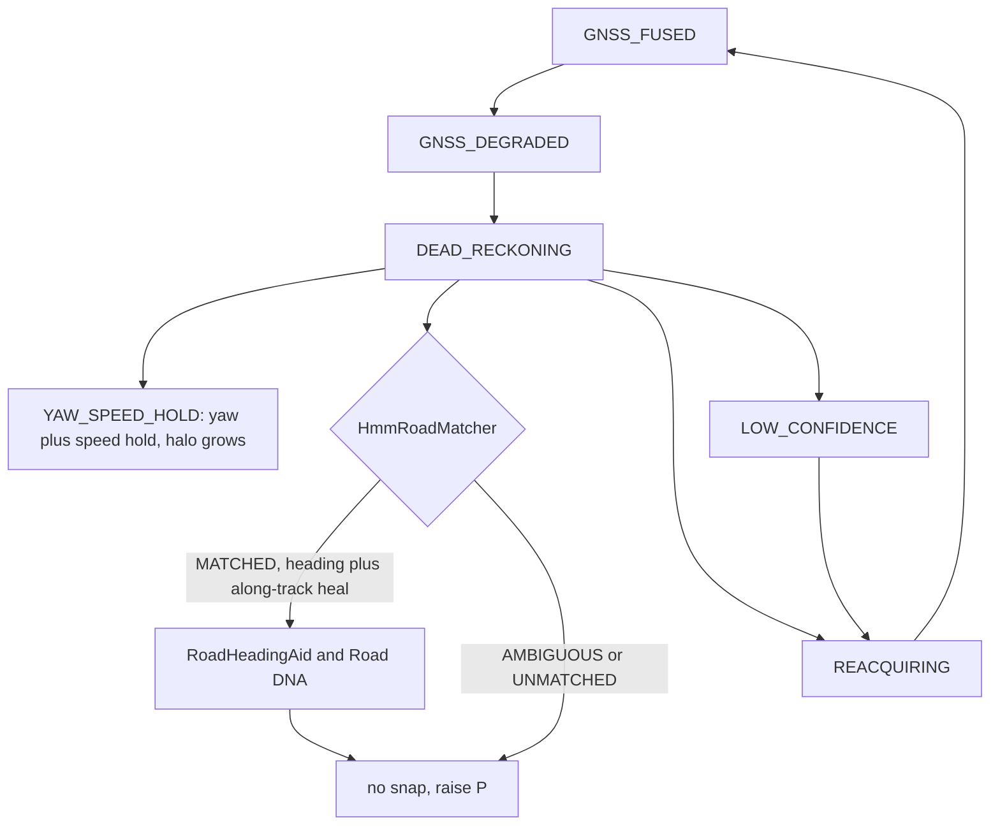
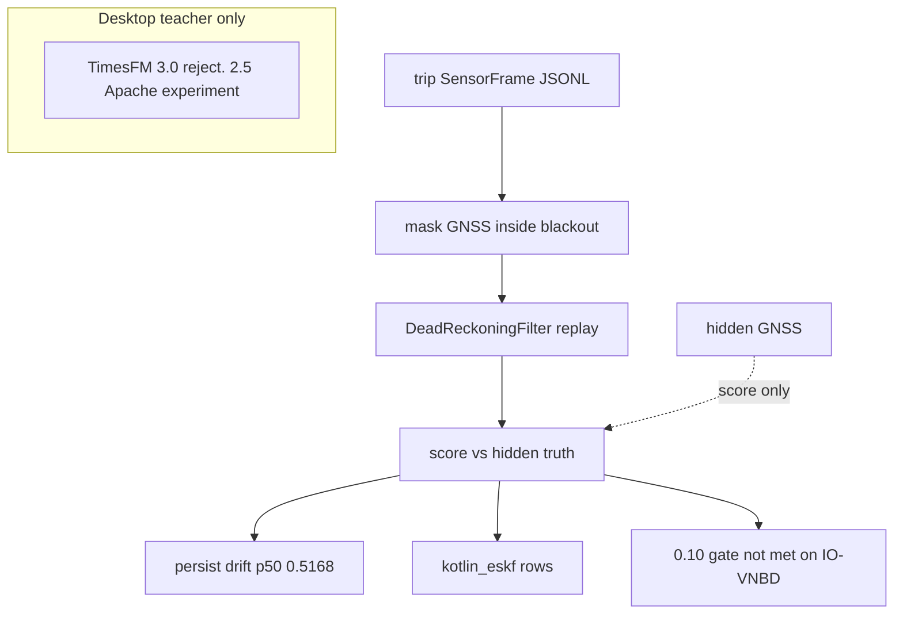
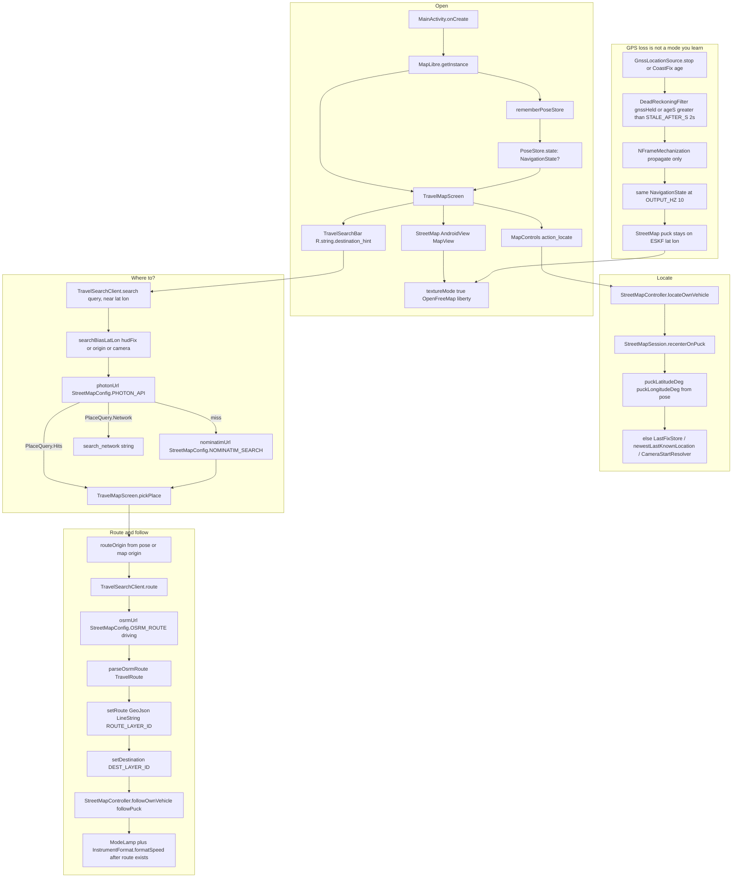
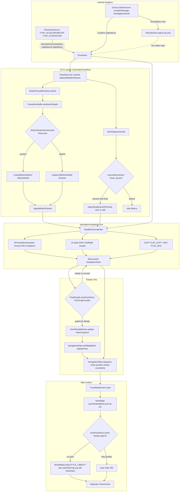

# DriftZero


Current improvement work: [coast correctness and phone placement continuity](docs/adr/011-coast-and-phone-continuity.md). No physical mount is required for a resting phone; pickup handling is conservative. The development-selected coast reaches 48.83% median drift on all 35 locked intervals, improved from the earlier 58.52%, but the less-than-10% objective is unmet. See the [v3 experiment and raw tables](docs/13_ACCURACY_V3_EXPERIMENT.md). Historical screening scores below are not new measurements. The [real-map and acceleration experiments](docs/14_REAL_MAP_EXPERIMENT.md) record development results and rejection decisions; they do not establish a new locked score.

[](https://github.com/NotDrake100/driftzero/actions/workflows/ci.yml)

Phone-only vehicle navigation that keeps a blue puck moving when GPS drops. The map is the product.

## What this is

A working phone instrument plus a leak-free desktop eval harness.

The APK copies phone sensors into `PoseStore`, runs `DeadReckoningFilter`, and emits `NavigationState` at 10 Hz. The map, mode lamp, status sheet, and guidance read that state. Desktop replay scores the same filter against hidden GNSS after a blackout mask. TimesFM is not in the APK. No OBD. No city is hardcoded.

Emulator shots under `results/emulator/` use mock GPS and a fake IMU. They are not phone accuracy. Airplane-mode Pune streets were captured (`offline-pune.png`). Offline tap-to-route on the emulator was not captured. The official 0.10 median drift gate is not met on IO-VNBD. Persist is the held-out coast to beat (drift p50 0.5168).

Same figures: [docs/figures/architecture.md](docs/figures/architecture.md), [docs/figures/outage.md](docs/figures/outage.md), [docs/figures/eval.md](docs/figures/eval.md).

### Phone live path

Sensors copy into `PoseStore`. Mount still plus straight can emit `VEHICLE_FLU`. NHC runs only in that frame. Magnetometer is stored and unused. Hold GNSS stops `ingestGnss`. The matcher overlays `displayPose`. It does not write lat/lon into the ESKF. When a Ready `graph.bin` is MATCHED, live coast may apply a heading prior and an along-track Road DNA heal. Unmatched coasts raise uncertainty. `LocalRouter` is the graph router when a Ready pack has `graph.bin`. TimesFM is not on this path.

Eval replay selects `--coast-mode=yaw_speed_hold` explicitly. Live `PoseStore.LIVE_INS_CONFIG` already selects `YAW_SPEED_HOLD`, with an 8 s stale threshold and conservative uncertainty growth. Replay defaults remain `STRAPDOWN`; live and screening configurations are distinct.



### GNSS outage

Mode words on `NavigationState.mode`. Halo radius is `uncertainty.horizontal95`. Optional `RoadHeadingAid` is heading-only when MATCHED. Live `PoseStore` and a graph-attached `DeadReckoningEngine` apply it while coasting. Along-track Road DNA may heal odometer error. Lat/lon are never snapped.



### Eval and leakage wall

Trip JSONL in, GNSS keys dropped inside the mask, then replay, then score. Hidden truth is not a filter input. Persist versus `kotlin_eskf` rows. TimesFM is a desktop teacher only.

kotlin_eskf_v5 on leak-free frames: drift p50 0.611, endpoint p50 187.5 m, 1 Hz slice 0.257. Do not cite leaky-frame 0.541 as the headline. Persist drift p50 0.5168. The 0.10 gate is not met on IO-VNBD.



The consumer path is a phone, offline after an area pack is installed, no OBD-II, no vehicle speedometer, no LiDAR, no custom antenna, and no cloud inference. The filter emits `NavigationState` at 10 Hz. TimesFM is not in the APK.

Open the app, allow precise location, tap locate, type **Where to?**, pick a place, and follow the route. You do not flip a dead-reckoning switch. When GNSS is stale or held, `DeadReckoningFilter` keeps propagating the same `NavigationState` at 10 Hz.

Street tiles still come from the network (`StreetMapConfig.STYLE_LIBERTY` on OpenFreeMap) until a Ready `AreaPack` with `tiles.pmtiles` is sideloaded.

## Status

Honest as of 2026-09-03. Screening source of record: [results/io_vnbd_screening_v1/summary.md](results/io_vnbd_screening_v1/summary.md) (git `069e74b` plus the uncommitted `ml/` tree, seed 26168, IO-VNBD checkout `1189396`). The official median drift gate of 0.10 is not met. Do not cite a mean-only drift number. `filter_only` in that table is the Python coast. Persist is the held-out coast to beat (drift p50 0.5168, endpoint p50 234.47 m on 35 intervals). timesfm_coast is in that table: drift p50 0.6048, worse than persist 0.5168, better than linear 0.7132. Desktop TimesFM 3.0 run rejected. Keep both product-filter rows: `kotlin_eskf` drift p50 6.6863 on 33 of 35 intervals, endpoint p50 2669.27 m; `kotlin_eskf_v2` drift p50 7.5650 on 35 intervals, endpoint p50 2996.50 m. Both worse than persist. LOW_CONFIDENCE 5326 of 11325 blackout states on `kotlin_eskf`. S-S1:mid rose from 21322 m to 145748 m on v2. Diagnosis stopped. The product filter is not the screening headline. Do not start another silent filter tweak.

**Works in this repository**

- Android travel map: MapLibre Native, Photon then Nominatim, public OSRM, locate, route follow, GPS-hold long-press. See [PRODUCT.md](PRODUCT.md).
- Live 10 Hz pose: `PoseStore` plus `DeadReckoningFilter` (ENU strapdown, 15-state ESKF, ZUPT/NHC). Modes `GNSS_FUSED`, `GNSS_DEGRADED`, `DEAD_RECKONING`, `REACQUIRING`, `LOW_CONFIDENCE`.
- Optional on-device speed weights in `models/motion_student_v1/linear.json` (corrected m/s labels, grouped session splits). Missing weights leave `ZuptAccelMotionModel`. Do not cite `train_report_invalid_kmh_labels.json`. `gru.json` is analysis-only. No Kotlin GRU runtime.
- Optional gated Δp from `models/learned_imu_v1/linear_dp.json`. The checked-in train report says Δp MAE is worse than freeze. Not a screening claim.
- Display-only HMM road match when an area pack has `graph.bin`. The matcher does not replace ESKF lat/lon.
- NavIC/IRNSS tallies from `GnssStatus`. Counts are log and chip only. They do not enter the filter.
- Python stdlib tests for contracts, blackout masking, metrics, IO-VNBD fixtures, and the TimesFM adapter boundary.
- Desktop TimesFM 3.0 zero-shot: reject. Report: `results/timesfm/summary.md` (historical report absent from this checkout). timesfm==3.0.1, checkpoint `google/timesfm-3.0-pytorch`, seed 26168, MPS, 24.1 min. timesfm_coast drift p50 0.6048 on 35 gated intervals, worse than persist 0.5168, better than linear 0.7132. Ridge beat TimesFM on speed at 1 s, 2 s, and 5 s. TimesFM beat persist on yaw only. Speed PICP 68 was 0.01 to 0.05. Distillation was not attempted. 3.0 weights cannot ship. It stays off the phone.
- JSON Schema for `SensorFrame` and `NavigationState` under `contracts/`.

**Planned or pending evidence**

- IO-VNBD raw CSVs are not in Git. Fetch with Git LFS into gitignored `data/raw/`. Commands: [scripts/fetch_datasets.md](scripts/fetch_datasets.md).
- Python screening bundle exists at [results/io_vnbd_screening_v1/summary.md](results/io_vnbd_screening_v1/summary.md). Official 10 percent median drift gate is not met. Persist is the held-out coast to beat. timesfm_coast is in that table. `kotlin_eskf` and `kotlin_eskf_v2` are both in that file and both worse than persist. Diagnosis stopped. The product filter is not the screening headline. Protocol: [docs/06_EVALUATION_PROTOCOL.md](docs/06_EVALUATION_PROTOCOL.md).
- Airplane-mode tiles and graph after a Ready area pack. Hosted OpenFreeMap is the stand-in until then.
- Airplane-mode field video, India corridor pack, battery report, signed bundles, and a live 200 Hz external IMU run. Synthetic 200 Hz replay tests exist. No phone latency or satellite-count report.

## Start here

JDK 17 for JVM and Android. Python 3.10+ for `ml/`. Do not commit `data/raw` IO-VNBD CSVs.

```bash
PYTHONPATH=ml/src python -m unittest discover -s ml/tests -v
make validate
JAVA_HOME="$(/usr/libexec/java_home -v 17)" ./gradlew :navigation-core:test --no-daemon
JAVA_HOME="$(/usr/libexec/java_home -v 17)" ./gradlew :android-app:testDebugUnitTest :android-app:lintDebug :android-app:assembleDebug --no-daemon
```

`make validate` checks the four contract JSON files and reruns the Python tests. It does not invoke Gradle. `pytest.ini` uses the same `ml/src` path and `ml/tests` tree. Pytest and Ruff are optional (`./ml[dev]`). Unit tests use the standard library only.

Sideload notes: [demo/TESTER_SIDELOAD.md](demo/TESTER_SIDELOAD.md). Equation map: [docs/refs/INS_ESKF.md](docs/refs/INS_ESKF.md). How to contribute: [CONTRIBUTING.md](CONTRIBUTING.md).

## Repository map

| Path | What runs |
|---|---|
| `apps/android/app` | `MainActivity`, `TravelMapScreen`, `StreetMap`, `PoseStore`, Photon/OSRM |
| `packages/navigation-core` | `DeadReckoningFilter`, `HmmRoadMatcher`, `LinearMotionStudent` |
| `models/motion_student_v1/linear.json` | Optional on-device speed weights |
| `models/learned_imu_v1/linear_dp.json` | Optional gated Δp. Not a screening claim |
| `ml/` | Train/eval, IO-VNBD loaders, student export. [ml/README.md](ml/README.md) |
| `contracts/` | `SensorFrame` / `NavigationState` JSON Schema |
| `data/area-packs/` | Sideload target for PMTiles + `graph.bin` |
| `data/manifests/` | IO-VNBD screening manifest. Raw CSVs stay gitignored |
| `docs/adr/` | Filter, TimesFM teacher, offline maps, pose store, motion pseudo-measurement |
| `configs/` | Filter defaults, blackout protocol, TimesFM experiment gate |
| `tools/maps/` | Bbox pack manifest and OSM clip helpers |

## Evidence

Python screening v1 is at [results/io_vnbd_screening_v1/summary.md](results/io_vnbd_screening_v1/summary.md). 35 gated held-out intervals. The official median drift gate of 0.10 is not met. Per-system p50, p90, p95, and worst are in that file. Do not cite a mean-only drift number. `filter_only` is the Python coast. Persist is the held-out coast to beat (drift p50 0.5168, endpoint p50 234.47 m). timesfm_coast is in that same table: drift p50 0.6048, worse than persist 0.5168, better than linear 0.7132. Desktop report: `results/timesfm/summary.md` (historical report absent from this checkout). Verdict: reject. Two physics coasts were measured on the same 35 intervals and lost to persist. persist_curve drift p50 0.9727, linear_curve 0.7244. 10 Hz a_lat is too noisy. Correlation with GNSS speed is -0.02 to -0.17. Median relative error is 0.63 to 0.66. persist_selfcal drift p50 0.6220, linear_selfcal 0.6649. Small speed MAE win. Median drift is still worse than persist. Do not ship either as a coast. linear_selfcal may still be a student bias correction later. It is not a screening headline. Notes: `results/io_vnbd_screening_v1/physics_notes.md` (historical report absent from this checkout). Keep both product-filter rows: `kotlin_eskf` drift p50 6.6863 on 33 of 35 intervals, endpoint p50 2669.27 m; `kotlin_eskf_v2` drift p50 7.5650 on 35 intervals, endpoint p50 2996.50 m. Both worse than persist. LOW_CONFIDENCE 5326 of 11325 blackout states on `kotlin_eskf`. S-S1:mid rose from 21322 m to 145748 m on v2. Score-only plots: `plots/S-Vta2_mid.png`, `S-S1_mid.png`, `S-S3b_mid.png`. A full release bundle should still match [docs/06_EVALUATION_PROTOCOL.md](docs/06_EVALUATION_PROTOCOL.md) section 11. Latency and satellite figures are not in this bundle. Diagnosis stopped. The product filter is not the screening headline. Do not start another silent filter tweak.

Desktop train reports live next to the JSON weights:

- `models/motion_student_v1/train_report.json` and `models/motion_student_v1.manifest.json` (corrected m/s labels)
- `models/motion_student_v1/train_report_invalid_kmh_labels.json` (old 3.6x-small labels; do not cite)
- `models/motion_student_v2/train_report.json` and `gru.json` (analysis-only)
- `models/learned_imu_v1/train_report.json` and `models/learned_imu_v1.manifest.json`

Linear Δp is worse than freeze. Keep the χ² gate. Bump-gated R raised bump-window PICP 68 and did not change speed MAE. That is the only novelty claim.

Regenerate (needs a real IO-VNBD tree under `data/raw/io_vnbd/`, or synthetic if LFS is missing):

```bash
PYTHONPATH=ml/src python -m driftzero_ml.student.train --seed 26168
PYTHONPATH=ml/src python -m driftzero_ml.learned_imu --out models/learned_imu_v1
PYTHONPATH=ml/src python -m driftzero_ml.eval_iovnbd_blackout --out results/io_vnbd_blackout_eval.md
```

IO-VNBD LFS is pending for a clean clone. The only CSV in Git is `ml/tests/fixtures/io_vnbd_s_vta9_head.csv` (header plus 3 rows, CC BY 4.0 excerpt).

## Trip on the phone

`MainActivity` starts MapLibre, builds `rememberPoseStore()`, and shows `TravelMapScreen`. The map is `StreetMap` on a TextureView (`StreetMapConfig.TEXTURE_MODE`) so Compose can composite it. Chrome is `TravelSearchBar` (`destination_hint` = Where to?), locate (`StreetMapController.locateOwnVehicle`), and a route sheet after a pick.

Photon is the geocoder. The query is biased to the live pose (`searchBiasLatLon` from `hudFix`, else map origin, else camera). Nominatim is fallback. A hit calls `TravelSearchClient.route` against public OSRM, draws a GeoJSON polyline, and `followPuck()`.



Long-press the GPS chip to hold GNSS (`PoseStore.setSimulateGpsOff`). Accel and gyro keep copying. The puck does not freeze. Long-press again to resume `ingestGnss`.

## Live engine

`rememberPoseStore` owns `PoseStore`, starts `PhoneImuSource` and `GnssLocationSource`, and calls `PoseStore.tick()` at `DeadReckoningFilter.OUTPUT_HZ` (10). Sensor callbacks only copy samples. Inference and filter updates run on that tick.

`DeadReckoningFilter` is strapdown INS in ENU (`NFrameMechanization`, Groves local-tangent) plus a 15-state ESKF (`EskfMath` Joseph update: δp, δv, δθ, ba, bg). Healthy GNSS younger than 2 s updates. Otherwise the filter propagates. ZUPT and NHC come from IMU statistics. `NavicMonitor` tallies IRNSS from `GnssStatus` and logs. Those counts do not enter the filter.

`MotionStudentAssets` loads `models/motion_student_v1/linear.json` when packed. Missing weights leave `ZuptAccelMotionModel`. Optional `LearnedImuAssets` / `linear_dp.json` injects a chi-squared gated Δp. `HmmRoadMatcher` (Newson-Krumm) writes `mapMatch` / display pose only. It does not replace ESKF lat/lon. A Ready `graph.bin` also feeds `MapCoastSession` for MATCHED heading and along-track heal.



Modes on `NavigationState.mode` are `GNSS_FUSED`, `GNSS_DEGRADED`, `DEAD_RECKONING`, `REACQUIRING`, `LOW_CONFIDENCE`. The HUD chip reports them. The estimator does not wait for a user gesture to coast.

## Docs

Numbered files are 01 through 11. Existing numbers stay so citations do not break. GitHub mermaid figures: [docs/figures/architecture.md](docs/figures/architecture.md), [docs/figures/outage.md](docs/figures/outage.md), [docs/figures/eval.md](docs/figures/eval.md).

| Doc | Topic |
|---|---|
| [PRD.md](PRD.md) | Product requirements and scope |
| [PRODUCT.md](PRODUCT.md) | Five-step phone test |
| [AGENTS.md](AGENTS.md) | Engineering rules for this repo |
| [CONTRIBUTING.md](CONTRIBUTING.md) | How to run tests and change the tree |
| [SECURITY.md](SECURITY.md) | Local processing and how to report issues |
| [NOTICE.md](NOTICE.md) | Prototype notice and third-party attribution |
| [docs/01_SIH_REQUIREMENTS_TRACEABILITY.md](docs/01_SIH_REQUIREMENTS_TRACEABILITY.md) | Official requirement IDs |
| [docs/01_REQUIREMENTS_TRACEABILITY.md](docs/01_REQUIREMENTS_TRACEABILITY.md) | Alias to the locked matrix |
| [docs/RELATED_APPS.md](docs/RELATED_APPS.md) | Location-puck UX spec |
| [docs/02_ARCHITECTURE.md](docs/02_ARCHITECTURE.md) | Runtime topology and package boundaries |
| [docs/03_TIMESFM3_STRATEGY.md](docs/03_TIMESFM3_STRATEGY.md) | TimesFM 3.0 desktop teacher, reject |
| [docs/04_DATASETS_AND_DATA_GOVERNANCE.md](docs/04_DATASETS_AND_DATA_GOVERNANCE.md) | Splits, blackouts, India collection |
| [docs/05_MAPS_AND_MAP_MATCHING.md](docs/05_MAPS_AND_MAP_MATCHING.md) | PMTiles plus HMM graph |
| [docs/06_EVALUATION_PROTOCOL.md](docs/06_EVALUATION_PROTOCOL.md) | Metrics and result bundle |
| [docs/07_RESEARCH_AND_ROADMAP.md](docs/07_RESEARCH_AND_ROADMAP.md) | Gap audit, evaluator defects, ranked plan to Sep 20 |
| [docs/08_PRODUCT_DESIGN.md](docs/08_PRODUCT_DESIGN.md) | Field-instrument UI spec |
| [docs/09_SECURITY_PRIVACY_SAFETY.md](docs/09_SECURITY_PRIVACY_SAFETY.md) | Privacy, integrity language, safety |
| [docs/10_JUDGE_STORY.md](docs/10_JUDGE_STORY.md) | Judge demo order |
| [docs/11_GATE_PLAN.md](docs/11_GATE_PLAN.md) | Gate plan to 20 Sep |
| [docs/figures/architecture.md](docs/figures/architecture.md) | Phone live path mermaid |
| [docs/figures/outage.md](docs/figures/outage.md) | GNSS outage mermaid |
| [docs/figures/eval.md](docs/figures/eval.md) | Eval leakage wall mermaid |
| [docs/SIH_THIRD_PARTY.md](docs/SIH_THIRD_PARTY.md) | Contest-facing third-party note |
| [docs/SOURCES.md](docs/SOURCES.md) | Citations |
| [docs/adr/001-hybrid-filter.md](docs/adr/001-hybrid-filter.md) | Hybrid student plus ESKF |
| [docs/adr/002-timesfm-teacher.md](docs/adr/002-timesfm-teacher.md) | TimesFM 3 as teacher |
| [docs/adr/003-offline-maps.md](docs/adr/003-offline-maps.md) | PMTiles and road graph |
| [docs/adr/004-cv-stub.md](docs/adr/004-cv-stub.md) | Pose store and GNSS-off coast (filename is historical) |
| [docs/adr/005-motion-pseudo-measurement.md](docs/adr/005-motion-pseudo-measurement.md) | Motion pseudo-measurement |
| [docs/adr/007-mount-alignment.md](docs/adr/007-mount-alignment.md) | Mount still plus straight |
| [docs/adr/008-integrity-suite.md](docs/adr/008-integrity-suite.md) | GNSS trust, drift budget, road DNA |
| [docs/adr/009-persist-coast-seed.md](docs/adr/009-persist-coast-seed.md) | Persist-like coast seed picker |
| [docs/adr/010-road-particle-coast.md](docs/adr/010-road-particle-coast.md) | Research road-particle coast |
| [docs/refs/INS_ESKF.md](docs/refs/INS_ESKF.md) | Strapdown and ESKF equations |
| [docs/refs/DATASETS.md](docs/refs/DATASETS.md) | Dataset scorecard |
| [docs/refs/LEARNED_IMU.md](docs/refs/LEARNED_IMU.md) | RoNIN / TLIO / IONet heads |
| [docs/refs/MAP_MATCHING.md](docs/refs/MAP_MATCHING.md) | HMM formulas |
| [docs/refs/NAVIC.md](docs/refs/NAVIC.md) | IRNSS logging limits |
| [docs/refs/SIH26168_EVIDENCE.md](docs/refs/SIH26168_EVIDENCE.md) | Official problem text and independently fetched references |
| [demo/README.md](demo/README.md) | Demo package rules |

## Rules that stay true

Ground-truth GNSS may score a blackout. It must not enter features, the filter, the matcher, or recovery during that interval. No OBD, vehicle speedometer, cloud inference, or TimesFM on the phone path. Ambiguous road hypotheses stay uncertain. User-facing numbers include confidence and a reason. Do not invent metrics, traces, screenshots, satellite counts, or benchmark results.
