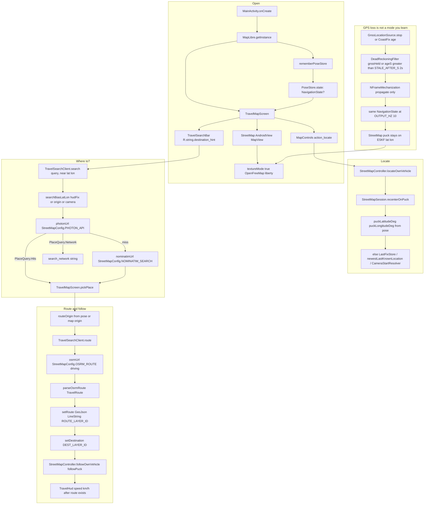
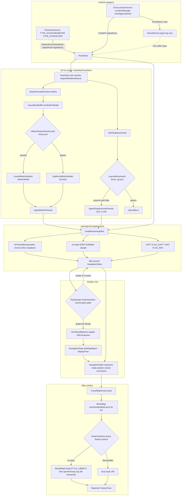

# DriftZero

Phone-only vehicle navigation that keeps a blue puck moving when GPS drops. The map is the product. LastKnown builds it.

Open the app, allow precise location, tap locate, type **Where to?**, pick a place, and follow the route. You do not flip a dead-reckoning switch. When GNSS is stale or held, `DeadReckoningFilter` keeps propagating the same `NavigationState` at 10 Hz.

Street tiles still come from the network (`StreetMapConfig.STYLE_LIBERTY` on OpenFreeMap) until a Ready `AreaPack` with `tiles.pmtiles` is sideloaded. TimesFM is not in the APK.

## Trip on the phone

`MainActivity` starts MapLibre, builds `rememberPoseStore()`, and shows `TravelMapScreen`. The map is `StreetMap` on a TextureView (`StreetMapConfig.TEXTURE_MODE`) so Compose can composite it. Chrome is `TravelSearchBar` (`destination_hint` = Where to?), locate (`StreetMapController.locateOwnVehicle`), and a route sheet after a pick.

Photon is the geocoder. The query is biased to the live pose (`searchBiasLatLon` from `hudFix`, else map origin, else camera). Nominatim is fallback. A hit calls `TravelSearchClient.route` against public OSRM, draws a GeoJSON polyline, and `followPuck()`.



Long-press the GPS chip to hold GNSS (`PoseStore.setSimulateGpsOff`). Accel and gyro keep copying. The puck does not freeze. Long-press again to resume `ingestGnss`.

## Live engine

`rememberPoseStore` owns `PoseStore`, starts `PhoneImuSource` and `GnssLocationSource`, and calls `PoseStore.tick()` at `DeadReckoningFilter.OUTPUT_HZ` (10). Sensor callbacks only copy samples. Inference and filter updates run on that tick.

`DeadReckoningFilter` is strapdown INS in ENU (`NFrameMechanization`, Groves local-tangent) plus a 15-state ESKF (`EskfMath` Joseph update: δp, δv, δθ, ba, bg). Healthy GNSS younger than 2 s updates. Otherwise the filter propagates. ZUPT and NHC come from IMU statistics. `NavicMonitor` tallies IRNSS from `GnssStatus` and logs. Those counts do not enter the filter.

`MotionStudentAssets` loads `models/motion_student_v1/linear.json` when packed. Missing weights leave `ZuptAccelMotionModel`. Optional `LearnedImuAssets` / `linear_dp.json` injects a chi-squared gated Δp. `HmmRoadMatcher` (Newson-Krumm) writes `mapMatch` / display pose only. It does not replace ESKF lat/lon.



Modes on `NavigationState.mode` are `GNSS_FUSED`, `GNSS_DEGRADED`, `DEAD_RECKONING`, `REACQUIRING`, `LOW_CONFIDENCE`. The HUD chip reports them. The estimator does not wait for a user gesture to coast.

## Start here

1. Read [PRD.md](PRD.md) and [PRODUCT.md](PRODUCT.md) (five-step phone test).
2. Sideload notes: [demo/TESTER_SIDELLOAD.md](demo/TESTER_SIDELLOAD.md).
3. Equation map: [docs/refs/INS_ESKF.md](docs/refs/INS_ESKF.md). Filter ADR: [docs/adr/001-hybrid-filter.md](docs/adr/001-hybrid-filter.md). Motion student: [docs/adr/005-motion-pseudo-measurement.md](docs/adr/005-motion-pseudo-measurement.md).
4. Requirement IDs: [docs/01_REQUIREMENTS_TRACEABILITY.md](docs/01_REQUIREMENTS_TRACEABILITY.md).

```bash
PYTHONPATH=ml/src python -m unittest discover -s ml/tests -v
make validate
JAVA_HOME="$(/usr/libexec/java_home -v 17)" ./gradlew :navigation-core:test --no-daemon
JAVA_HOME="$(/usr/libexec/java_home -v 17)" ./gradlew :android-app:testDebugUnitTest :android-app:lintDebug :android-app:assembleDebug --no-daemon
```

Python uses the standard library for unit tests. JVM and Android builds need JDK 17. Do not commit `data/raw` IO-VNBD CSVs.

## Repository map

| Path | What runs |
|---|---|
| `apps/android/app` | `MainActivity`, `TravelMapScreen`, `StreetMap`, `PoseStore`, Photon/OSRM |
| `packages/navigation-core` | `DeadReckoningFilter`, `HmmRoadMatcher`, `LinearMotionStudent` |
| `models/motion_student_v1/linear.json` | Optional on-device speed weights |
| `models/learned_imu_v1/linear_dp.json` | Optional gated Δp. Not a screening claim |
| `ml/` | Train/eval, IO-VNBD loaders, student export |
| `contracts/` | `SensorFrame` / `NavigationState` JSON Schema |
| `data/area-packs/` | Sideload target for PMTiles + `graph.bin` |
| `docs/adr/` | Filter, offline maps, CV stub, motion pseudo-measurement |
| `docs/CUT_VS_KEEP.md` | What to ship vs cut |
| `docs/RELATED_APPS.md` | Puck size and Where to? research |

## Rules that stay true

Ground-truth GNSS may score a blackout. It must not enter features, the filter, the matcher, or recovery during that interval. No OBD, vehicle speedometer, cloud inference, or TimesFM on the phone path. Ambiguous road hypotheses stay uncertain. User-facing numbers include confidence and a reason.
