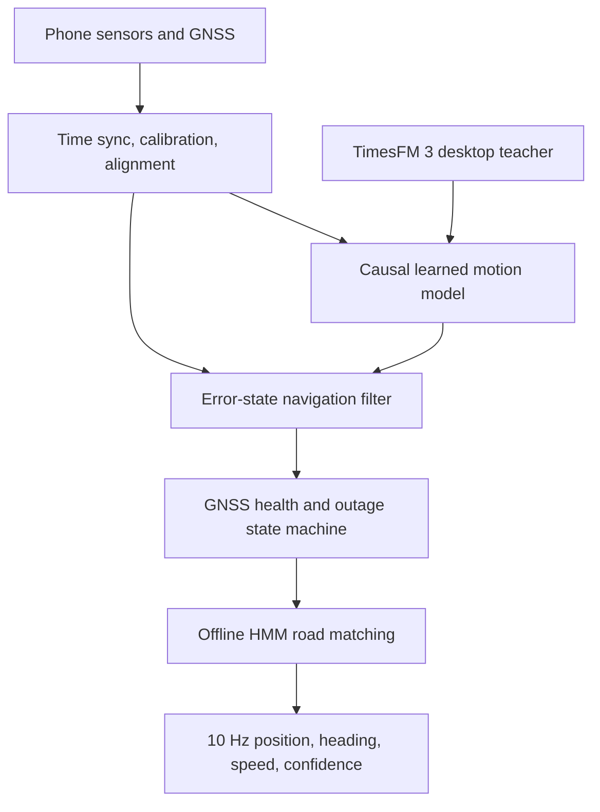

# DriftZero

**AI-Assisted Resilient Navigation Beyond GNSS**

DriftZero is an Android-first, software-only vehicle navigation engine for the SIH 2026 problem statement **SIH26168: AI-ML based Intelligent Dead Reckoning system for seamless navigation**. It keeps estimating a vehicle's position when GNSS is blocked, degraded, jammed, or inconsistent, using only the phone's accelerometer, gyroscope, magnetometer, GNSS, offline road data, and lightweight on-device inference.

This repository is a build-ready product and engineering blueprint. It includes the PRD, official requirement traceability, system architecture, TimesFM 3 research strategy, datasets, offline map plan, evaluation protocol, demo screenplay, Cursor rules, machine-readable contracts, experiment configuration, and tested metric utilities.

## Product promise

- Seamless transition from fused GNSS navigation to inertial dead reckoning and back.
- Standalone Android phone, with no OBD-II, speedometer, cloud, or custom vehicle hardware dependency.
- Target dead-reckoning drift below 10 percent of blackout distance, evaluated without label leakage.
- Smooth 10 Hz navigation output and an offline-first map experience.
- A reusable navigation core that can also accept an external IMU for the SIH edge-engine requirement.
- Honest confidence and degradation states rather than false lane-level certainty.

## The central technical decision

TimesFM 3 is not placed directly in the phone's 10 Hz navigation loop. The official model is roughly 0.3B parameters and its current weights are intended for research use. DriftZero uses it on desktop as a zero-shot multivariate forecasting baseline, uncertainty teacher, and hypothesis generator. If it improves held-out vehicle trajectories, its useful behavior is distilled into a small causal TCN or GRU student for on-device inference. The production loop remains deterministic, bounded, and functional even when the TimesFM adapter is absent.

## Architecture at a glance



## Start here

1. Read [PRD.md](PRD.md).
2. Check [official requirement traceability](docs/01_SIH_REQUIREMENTS_TRACEABILITY.md).
3. Review [architecture](docs/02_ARCHITECTURE.md) and [TimesFM 3 strategy](docs/03_TIMESFM3_STRATEGY.md).
4. Give Cursor [the master build prompt](tasks/CURSOR_MASTER_BUILD_PROMPT.md), then execute phase prompts in order.
5. Run the research utilities:

```bash
PYTHONPATH=ml/src python -m unittest discover -s ml/tests -v
```

## Repository map

| Path | Purpose |
|---|---|
| `PRD.md` | Product scope, users, requirements, acceptance criteria, and launch plan |
| `docs/` | Traceability, architecture, research decisions, data, maps, evaluation, safety, and sources |
| `.cursor/rules/` | Persistent rules for Android, navigation, ML, and evidence integrity |
| `tasks/` | Master and phased Cursor implementation prompts |
| `contracts/` | Canonical JSON Schemas for sensor input and navigation output |
| `configs/` | Versioned experiment and blackout definitions |
| `ml/` | Tested research utilities and optional TimesFM adapter |
| `apps/android/` | Android implementation specification and project scaffold target |
| `packages/navigation-core/` | Platform-neutral navigation engine contract |
| `demo/` | Reproducible demo runbook, video narration, and shot list |

## Non-negotiable validation rule

Ground-truth GNSS may be retained to score an artificial outage, but it must never enter the model, filter, map matcher, feature scaler, or outage detector during that interval. Every result must include the trajectory split, blackout definition, device/route metadata, model hash, map extract hash, and configuration file.

## Status

This initial repository is a specification plus research harness, not a claim that the complete Android product has already been implemented. Milestones and definitions of done are in [the roadmap](docs/08_ROADMAP_AND_BACKLOG.md).
