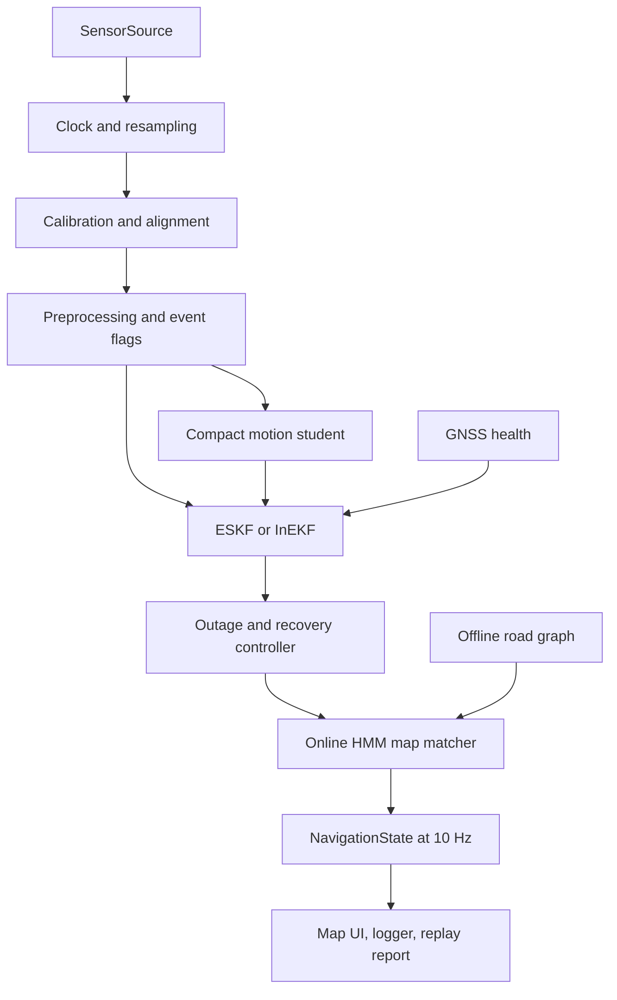
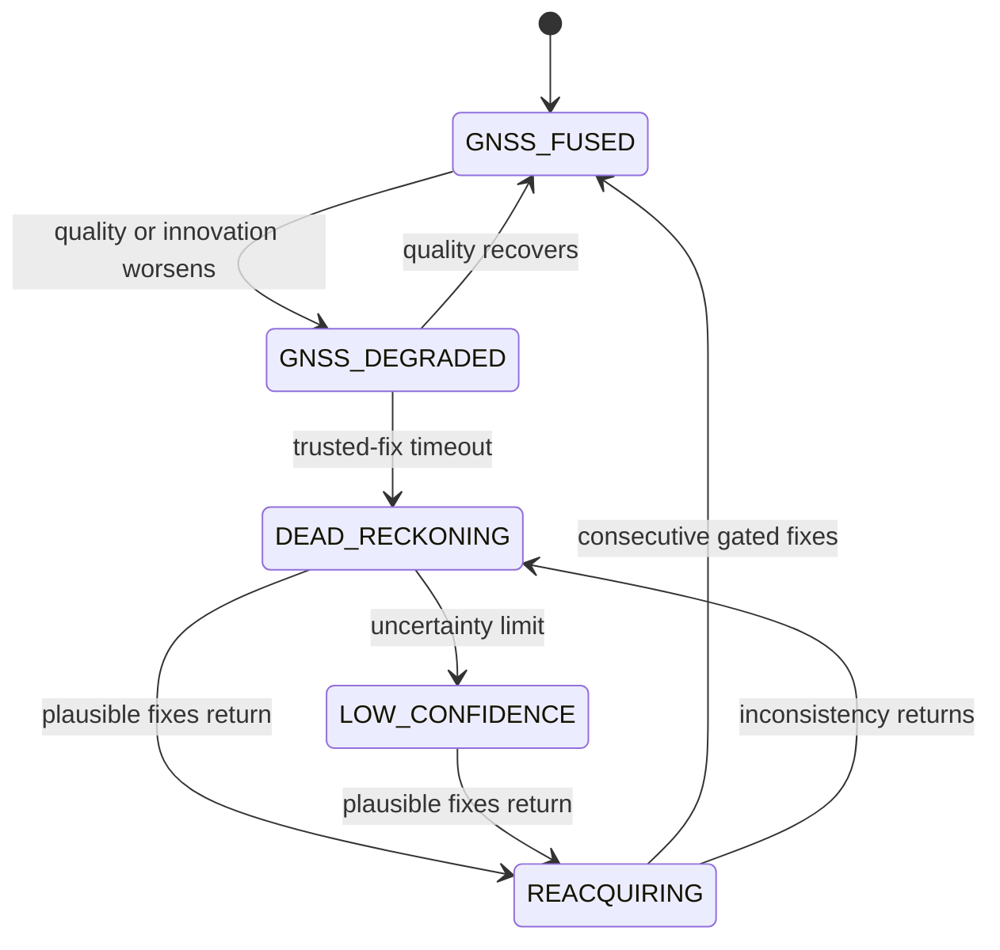
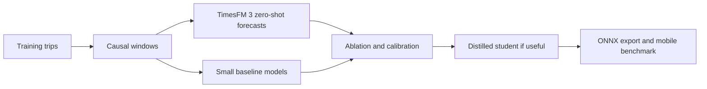

# Technical architecture

## 1. Architecture goals

The navigation loop must be causal, testable, offline, computationally bounded, and useful without any learned checkpoint. Learning improves motion estimates and uncertainty, while a physical state estimator preserves units, covariance, constraints, and fallbacks.

## 2. Runtime topology

### Threading and data ownership

- Sensor callback: copy immutable samples into a bounded lock-free or channel-backed queue. Do no ML or map work here.
- Navigation worker: deterministic ordering, resampling, propagation, updates, state machine, and output.
- Map worker: candidate queries and bounded Viterbi update, with deadline and last-safe-result fallback.
- UI: consumes immutable `NavigationState`; visual interpolation must not alter the logged estimator result.
- Logger: writes chunked sessions asynchronously with backpressure and dropped-record counters.

## 3. Canonical coordinate and time conventions

- Raw Android sensor timestamps: nanoseconds in the same monotonic time base documented for `SensorEvent.timestamp`.
- Internal time: integer nanoseconds; convert to seconds only at numerical boundaries.
- Raw phone frame: Android device coordinate convention, preserved with metadata.
- Vehicle frame: x forward, y left, z up.
- Navigation local frame: ENU anchored at the last stable origin or trip origin.
- Geographic output: WGS84 latitude, longitude, ellipsoidal or declared altitude.
- Acceleration: metres per second squared.
- Angular rate: radians per second.
- Heading: radians clockwise from true north internally, normalized consistently.

Every adapter must test its axis transform with known synthetic rotations and gravity.

## 4. Processing stages

### 4.1 Time synchronization and resampling

Use sensor timestamps, not callback arrival time. Maintain separate buffers for accelerometer, gyro, magnetometer, and GNSS. Propagate on gyro/accelerometer time. Interpolate only when bounded by nearby causal samples. Report gaps and avoid silently duplicating stale values.

For external data, estimate or declare clock offset and drift. Never infer synchronization from future ground truth in production.

### 4.2 Calibration and alignment

At startup:

1. detect a stationary interval from gyro energy and acceleration variance;
2. estimate gyro bias and gravity direction;
3. estimate accelerometer bias cautiously, because gravity and tilt are coupled;
4. initialize phone-to-navigation attitude;
5. collect safe forward-motion evidence from accepted GNSS course and inertial correlation;
6. estimate phone-to-vehicle yaw and quality;
7. continue a slow online bias process with covariance.

Do not trust magnetometer heading by default. Gate it using field magnitude, temporal consistency, vehicle state, and disagreement with other evidence.

### 4.3 Preprocessing and feature builder

Causal features may include:

- vehicle-frame acceleration and angular rate;
- norms, jerk, and band-limited vibration energy;
- gravity-aligned vertical acceleration;
- short-window statistics computed from past samples only;
- stationary, bump, braking, and turning probabilities;
- sensor accuracy, gap, saturation, and temperature indicators;
- prior filter speed and yaw uncertainty;
- accepted, delayed GNSS innovation history outside blackouts;
- local road curvature and heading hypotheses, clearly marked as map context.

Feature scalers are fitted on training trips only and serialized with the model.

### 4.4 Learned motion model

Candidate student architectures are a depthwise causal TCN and a small GRU. Initial target outputs:

- non-negative forward speed or signed speed increment;
- yaw-rate correction or heading increment;
- stop probability;
- log variance for each pseudo-measurement;
- optional process-noise multiplier clipped to a safe range.

The output is a pseudo-measurement, not a direct overwrite of navigation state. Uncertainty is calibrated on a validation set and bounded at runtime. An out-of-distribution score may inflate uncertainty or disable the learned update.

### 4.5 Navigation state estimator

Proposed nominal state:

\[
\mathbf{x} = [\mathbf{p}, \mathbf{v}, \mathbf{q}, \mathbf{b}_a, \mathbf{b}_g]
\]

with an error state and covariance containing position, velocity, attitude error, accelerometer bias, and gyroscope bias. Optional scale or mounting terms require an observability test before inclusion.

Updates:

- accepted GNSS position and velocity;
- learned forward-speed pseudo-measurement;
- learned yaw or yaw-rate correction if empirically stable;
- non-holonomic lateral and vertical velocity constraints when the vehicle is not slipping or airborne over a bump;
- zero-velocity update only under high-confidence stop detection;
- zero integrated heading-rate or straight-motion constraint when justified;
- map hypothesis as a soft update with covariance, never an unconditional snap.

The filter must use Joseph-form covariance updates or another numerically stable implementation, quaternion normalization, finite checks, and reset/recovery policy.

### 4.6 GNSS health

GNSS health combines:

- fix age and provider status;
- reported horizontal accuracy and speed/bearing accuracy;
- satellite count and constellation mix where available;
- raw-measurement diagnostics on capable phones;
- position/velocity normalized innovation squared;
- impossible acceleration or course change;
- disagreement with inertial and road hypotheses;
- persistent rather than single-sample evidence.

This is an integrity-risk score, not a certified spoofing detector. NavIC/IRNSS membership is logged from Android `GnssStatus` (`docs/refs/NAVIC.md`). Those counts are not a filter measurement and are not integrity.

### 4.7 State machine

Entry and exit thresholds use hysteresis. In `REACQUIRING`, estimate a correction and blend it over time or distance while keeping filter consistency. A single new fix must not teleport the marker.

### 4.8 Road matching

At each output epoch:

1. query graph segments intersecting the covariance-bounded search region;
2. project the estimate onto each segment and calculate emission cost;
3. include heading agreement, road direction/access, layer/tunnel/bridge, and speed plausibility;
4. compare graph path distance and topology with the recent dead-reckoned displacement;
5. run a rolling Viterbi beam, preserving a small number of hypotheses;
6. commit older states only after sufficient evidence;
7. return matched, ambiguous, or unmatched with confidence.

Do not feed a hard snapped point back into the filter at high confidence. Convert the selected road constraint to a soft cross-track or heading measurement whose covariance grows with ambiguity.

## 5. TimesFM research topology

TimesFM is isolated under `ml/`:

No Android package may depend on the TimesFM Python environment or checkpoint.

## 6. Package boundaries

| Package | Owns | Must not own |
|---|---|---|
| Sensor adapter | Platform capture and raw schema mapping | Filter or UI policy |
| Navigation core | State, propagation, measurement updates, state machine | Android APIs |
| Motion model runtime | Feature contract and on-device inference | Dataset splitting |
| Map core | Road graph query, candidates, HMM state | Visual rendering |
| Android app | Permissions, services, area management, UI | Research-only code |
| Research ML | Importers, training, TimesFM, evaluation | Product claims without locked results |
| Replay | Session parsing and deterministic source | Hidden algorithm variants |

## 7. Fallback ladder

1. Full learned plus filter plus map system.
2. Learned model rejected: filter plus kinematic constraints plus map.
3. Map package unavailable: filter plus learned model with visible confidence.
4. Magnetometer unreliable: inertial/GNSS course without magnetometer update.
5. Missing sensor or timing failure: freeze or degrade explicitly, never extrapolate without a confidence limit.

## 8. Implementation ADRs

- [Hybrid learned filter](adr/001-hybrid-filter.md)
- [TimesFM as teacher](adr/002-timesfm-teacher.md)
- [Offline map package](adr/003-offline-maps.md)
- [Motion pseudo-measurement hook](adr/005-motion-pseudo-measurement.md)

