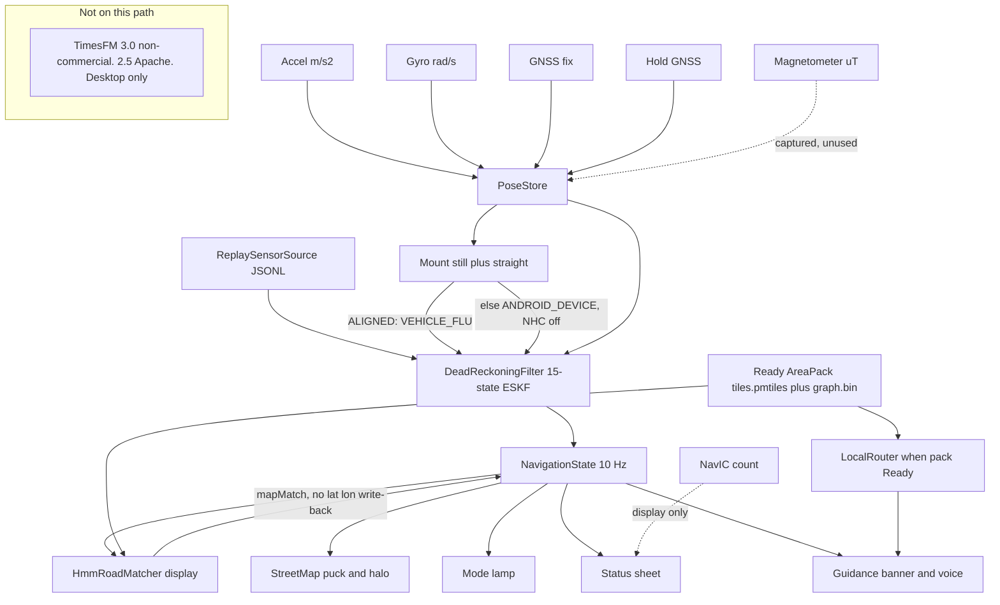

# DriftZero architecture (as of 2026-09-03)

Phone sensors and a `SensorFrame` JSONL file both enter `DeadReckoningFilter`. Output is `NavigationState` at 10 Hz (`contracts/navigation_state.schema.json`). TimesFM sits on the desktop only. It is not imported by `packages/navigation-core` or `apps/android`.

Live `PhoneImuSource` registers accelerometer, gyroscope, and magnetometer. Mag is stored in uT and `consume()` no-ops `MAGNETOMETER`. Mount still plus straight can rotate IMU into `VEHICLE_FLU`. NHC runs only in that frame. `HmmRoadMatcher` writes `mapMatch` / `displayPose`. Lat/lon are never snapped into the ESKF. `RoadHeadingAid` is a heading-only prior when MATCHED. Live `PoseStore` applies it through `MapCoastSession` while coasting, plus along-track Road DNA when the signature is unique. `LocalRouter` is the graph router when a Ready pack has `graph.bin`. Airplane-mode streets were captured. Offline tap-to-route on the emulator was not captured.

Eval replay uses `--coast-mode=yaw_speed_hold`. Live `PoseStore` still constructs `DeadReckoningFilter()` with default `InsConfig` (`STRAPDOWN`). Chi-squared 11.345 is the Δp displacement gate. Forward speed from `LinearMotionStudent` uses `R = exp(logSpeedVariance)` and runs only while GNSS is held or older than 2 s. GNSS position uses a geometric innovation gate `6 * (σ + √P)`.

Visitor copy of this figure is in the README under Phone live path. Outage and eval: [outage.md](outage.md), [eval.md](eval.md).

