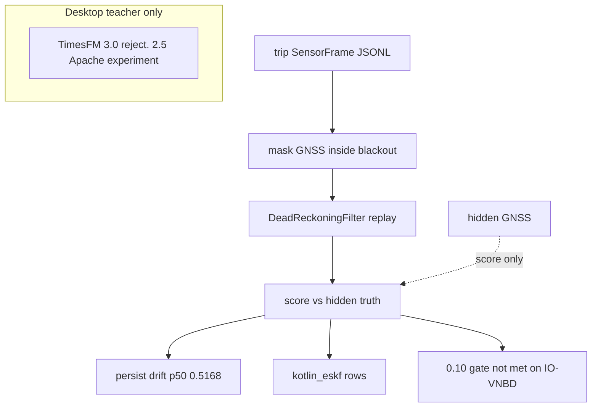

# Eval and leakage wall (as of 2026-09-03)

Trip JSONL in. GNSS keys dropped inside the blackout. `DeadReckoningFilter` replay. Score against hidden truth. Persist versus `kotlin_eskf` rows. TimesFM is a desktop teacher only. 3.0 weights are non-commercial. 2.5 is the Apache experiment. Neither is on the phone.

Persist drift p50 0.5168 on 35 gated IO-VNBD intervals. The official 0.10 median drift gate is not met. kotlin_eskf_v5 on leak-free frames: drift p50 0.611, endpoint p50 187.5 m, 1 Hz slice 0.257. Do not cite leaky-frame 0.541 as the headline.

Visitor copy: README, Eval and leakage wall.

