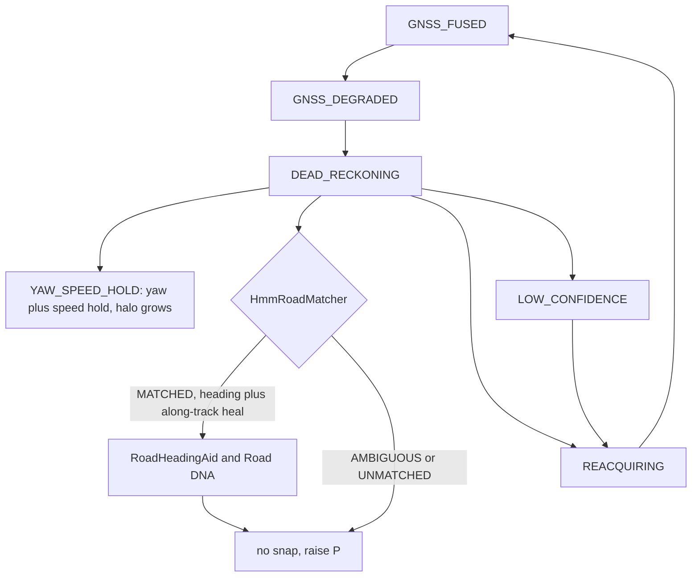

# GNSS outage (as of 2026-09-03)

Mode words on `NavigationState.mode`. Halo radius is `uncertainty.horizontal95`. `YAW_SPEED_HOLD` holds yaw and speed while coasting. Eval replay passes `--coast-mode=yaw_speed_hold`. Live `PoseStore` still uses default `InsConfig` (`STRAPDOWN`).

Optional `RoadHeadingAid` is a yaw prior when MATCHED. It never returns a position. Live `PoseStore` applies `applyRoadHeading` and may apply `applyAlongTrack` through `MapCoastSession`. Unmatched or ambiguous coasts raise P. Lat/lon are never snapped into the filter.

Visitor copy: README, GNSS outage.

